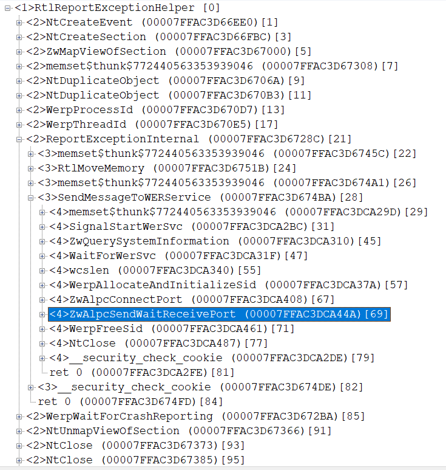

ntoskrnl read
```
HKEY_LOCAL_MACHINE\SYSTEM\CurrentControlSet\Control\Session Manager @ CriticalSectionTimeout
```
value but only on boot. 
so when we change this value, it take effect only after system reboot

when new process start, ntoskrnl write this value to `PEB::CriticalSectionTimeout`

when process itinialized in user mode, ntdll read `PEB::CriticalSectionTimeout` and write it to `RtlpTimeout` (global variable in ntdll, not exported)

```
LARGE_INTEGER RtlpTimeout;
RtlpTimeout.QuadPart = peb->CriticalSectionTimeout.QuadPart;
```

then ntdll look, are `IMAGE_LOAD_CONFIG_DIRECTORY` exist in exe and if yes and `CriticalSectionDefaultTimeout` not 0, it used

```
PIMAGE_LOAD_CONFIG_DIRECTORY p; 
if (ULONG64 CriticalSectionDefaultTimeout = p->CriticalSectionDefaultTimeout)
{
   RtlpTimeout.QuadPart = CriticalSectionDefaultTimeout * -10000; 
}
```

then exist next code

```
BOOLEAN RtlpTimeoutDisable;
if (RtlpTimeout.QuadPart < -60*60*10000000)
{ 
  RtlpTimeoutDisable = true; 
} 
```

so if timeout more(or equal) than 3600 secods (1 hour) it disabled.

exist yet one global variable

```
BOOLEAN RtlpRaiseExceptionOnPossibleDeadlock;
```

ntdll first look under 

```
HKLM\SYSTEM\CurrentControlSet\Control\Session Manager @ RaiseExceptionOnPossibleDeadlock 
```
if not exist - by default FALSE
and then under 

```
HKLM\SOFTWARE\Microsoft\Windows NT\CurrentVersion\Image File Execution Options\<your exe name>.exe @ RaiseExceptionOnPossibleDeadlock
```

when ntdll wait for critical section and wait timeout - it begin loop and print under loop

```
RTL: Enter CriticalSection Timeout (%u secs) #i
RTL: Pid.Tid %u.%u, owner tid %u Critical Section %p - ContentionCount == 1
RTL: Re-Waiting
```
and only at #i >= 3 it call `RtlpPossibleDeadlock`

(so timeout by fact multiple on 3)

this api call `SendMessageToWERService`



and then, if `RaiseExceptionOnPossibleDeadlock` is true - `STATUS_POSSIBLE_DEADLOCK` is raised.

but `RtlpPossibleDeadlock use SEH handler - it call `UnhandledExceptionFilter`

how this function work, depend from, are debugger is attached to process, and if not - `RtlKnownExceptionFilter` called from ntdll. 
this exported api have very simply implementation:

```
NTSTATUS WINAPI RtlKnownExceptionFilter(PEXCEPTION_POINTERS pep)
{
    return STATUS_POSSIBLE_DEADLOCK == pep->ExceptionRecord->ExceptionCode 
        ? EXCEPTION_CONTINUE_EXECUTION : EXCEPTION_CONTINUE_SEARCH; 
}
```

if exception code is `STATUS_POSSIBLE_DEADLOCK` the `EXCEPTION_CONTINUE_EXECUTION` returned.
this mean if we use SEH handler around `EnterCriticalSection` - it never will be called, if debugger not attached - execution return to `RtlpPossibleDeadlock`

so if we want catch exception - need use VEH handler, which called before SEH.

demo code:

```
NTSTATUS WINAPI CheckDeadLock(PEXCEPTION_POINTERS pep)
{
    if (STATUS_POSSIBLE_DEADLOCK == pep->ExceptionRecord->ExceptionCode)
    {
        MessageBoxW(0, 0, L"STATUS_POSSIBLE_DEADLOCK", MB_ICONINFORMATION);
        ExitProcess((ULONG)STATUS_POSSIBLE_DEADLOCK);
    }

    return EXCEPTION_CONTINUE_SEARCH; 
}

ULONG WINAPI dfg(CRITICAL_SECTION* pcs)
{
    EnterCriticalSection(pcs);
    LeaveCriticalSection(pcs);
    return 0;
}

    if (PVOID pv = AddVectoredExceptionHandler(TRUE, CheckDeadLock))
    {
        CRITICAL_SECTION cs;
        InitializeCriticalSection(&cs);
        EnterCriticalSection(&cs);
        if (HANDLE hThread = CreateThread(0, 0, (LPTHREAD_START_ROUTINE)dfg, &cs, 0, 0))
        {
            WaitForSingleObject(hThread, INFINITE);
            NtClose(hThread);
        }

        RemoveVectoredExceptionHandler(pv);
    }
```

project CsDeadLock is demo implementation of this. when Scst tool for set `CriticalSectionDefaultTimeout` and `Image File Execution Options`